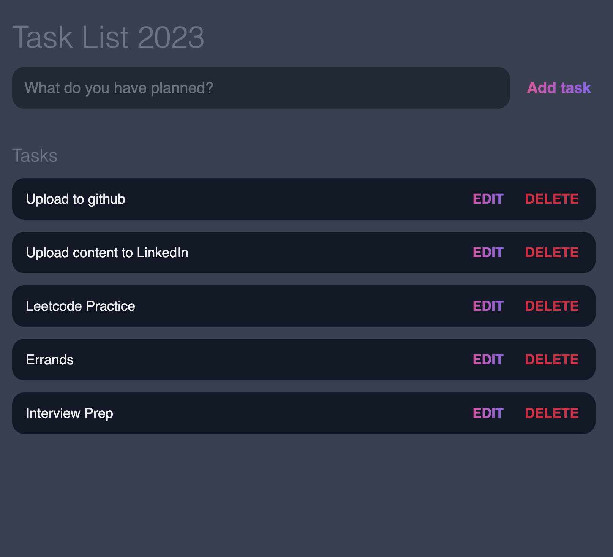

# To Do List

Functionality

I wanted to practice making a similar styled to-do-list as I've made before. This time I wanted to do it completely independently of tutorials wheras last time I was heavily reliant on direction.

Add tasks
Delete tasks
Edit tasks that have been added
